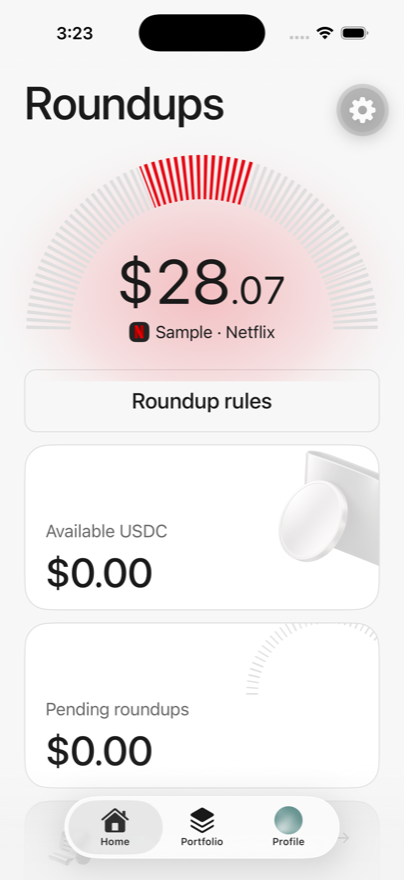
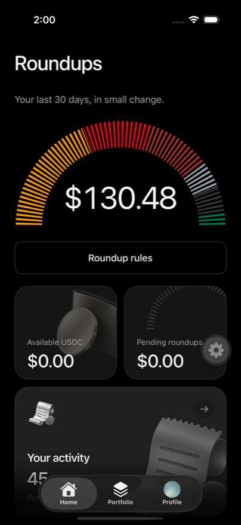
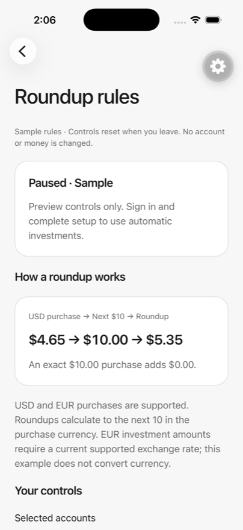
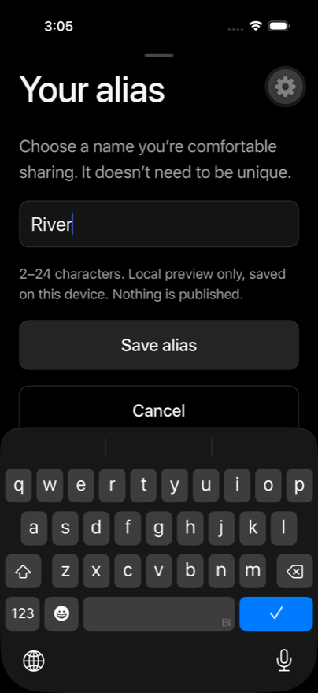

<div align="center">


# Beaver

**Turn everyday purchases into stock investments.**

[](https://github.com/0xfreddy/beaver/actions/workflows/ci.yml)
[](LICENSE)
[](CONTRIBUTING.md)
[](https://expo.dev)

<!-- App Store URL still pending at launch -->
<a href="#-try-it"></a>
<a href="https://testflight.apple.com/join/PXFVSPG6"></a>

Beaver rounds up your everyday card purchases and invests the spare change
into fractional stock — automatically, with friends, settled on-chain.

</div>

---

<p align="center">
  
  
  
  
</p>

## 📱 Try it

| Release channel | Version | Description | Link |
| :--- | :--- | :--- | :--- |
| Production | v0.1.0 | The same build as Beaver on the App Store. | 🚧 coming soon |
| TestFlight | latest | Public beta — newest features, may contain bugs. | [Join the beta](https://testflight.apple.com/join/PXFVSPG6) |
| **Run locally** | — | **The full app in mock mode** — no keys, no backend. | [Build it yourself ↓](#-build-it-yourself) |

## ✨ What it does

- 💳 **Roundups** — connect a card, and every purchase rounds up into your portfolio
- 📈 **Fractional stock** — spare change flows into tokenized stocks (xStocks), settled on-chain
- 👥 **Social** — invite friends with codes, climb leaderboards, keep your identity to an alias
- 💸 **Withdrawals** — cash out to your own crypto card, gated by Face ID and jurisdiction checks
- 🌗 **Native feel** — Liquid Glass on iOS 26, dark mode, haptics, and an offline mock account

## 🔓 What's open, what's not

This repository contains Beaver's **mobile client**. The account service it
talks to — roundup decisions, bank sync, execution, withdrawals — is a
separate, closed-source backend. That means everything here builds and runs
**with zero API keys and zero backend** against the built-in mock engine, and
money-moving logic never ships in this repo. Details and diagrams:
[docs/architecture.md](docs/architecture.md).

## 🔨 Build it yourself

**Prerequisites:** Node ≥ 22.13, pnpm 11 (`corepack enable`), and Xcode or
Android Studio for native builds. Web runs with nothing but Node.

```sh
git clone https://github.com/0xfreddy/beaver.git
cd beaver
pnpm install
cp apps/mobile/.env.example apps/mobile/.env
pnpm dev:mobile        # press i (iOS), a (Android), or w (web)
```

Once it's running you can:

1. Browse a full sample account — purchases, roundups, portfolio, performance
2. Connect and disconnect the mock bank link
3. Tune your roundup rules and watch the math update
4. Invite friends, rename your alias, and climb the leaderboard
5. Request a withdrawal to a crypto card (devnet, simulated end to end)

You need **zero API keys** for all of the above. Live sign-in and real data
require Privy and API credentials we can't share, so design changes to work in
mock mode.

#### Use your own API tokens

Good news: **you don't need any.** The app runs fully in mock mode out of the
box — that is the default development experience. If you want live sign-in or
telemetry, these are the knobs:

| Name | Service | Url | Comments |
| :--- | :--- | :--- | :--- |
| `EXPO_PUBLIC_PRIVY_APP_ID` / `EXPO_PUBLIC_PRIVY_CLIENT_ID` | Privy auth | <https://privy.io> | Only for live sign-in. Mock mode needs none. |
| `EXPO_PUBLIC_API_URL` | Account service | — | Mock mode intercepts it; defaults to `http://localhost:3000`. |
| `EXPO_PUBLIC_SOLANA_NETWORK` | Solana cluster | <https://solana.com> | `devnet` by default; production builds pin `mainnet`. |
| `EXPO_PUBLIC_SENTRY_DSN` | Sentry | <https://sentry.io> | Optional. |
| `EXPO_PUBLIC_POSTHOG_KEY` | PostHog analytics | <https://posthog.com> | Optional. We never track PII. |
| `EXPO_PUBLIC_EAS_PROJECT_ID` | Your own EAS project | <https://expo.dev> | Optional — only for OTA updates on a fork. |

Full reference: [docs/build.md](docs/build.md).

## 🧱 Architecture

Expo (SDK 57) + React Native, TypeScript strict throughout, three workspaces:
the app (`apps/mobile`), the shared contracts (`packages/types`), and the pure
roundup math (`packages/domain`). The closed service sits behind an HTTPS API
validated by those shared contracts. Map and data flow:
[docs/architecture.md](docs/architecture.md).

## 🔬 Tests

Unit tests run on [Vitest](https://vitest.dev) — check out the `*.test.ts`
files colocated with the source. Coverage is strongest in the roundup math and
the mobile data layer; the UI layer isn't covered yet and E2E (Maestro against
mock mode) is on the roadmap. We hold merged code to `pnpm check` and prefer a
small test that explains *why* it exists. Guide: [docs/testing.md](docs/testing.md).

## 🙋 Contribute

If you find a bug, or if you have an idea for Beaver, please
[file an issue](https://github.com/0xfreddy/beaver/issues) — we really appreciate
feedback and input! For code contributions, start with
[CONTRIBUTING.md](CONTRIBUTING.md): setup, code style, and the PR checklist
(including per-platform QA). For vulnerabilities, follow [SECURITY.md](SECURITY.md)
instead of opening a public issue.

## 📰 License

The client code is [MIT licensed](LICENSE). The Beaver name, logo, and
illustration assets are **not** covered by MIT — fork the code, replace the
branding. Fonts ([Faculty Glyphic](https://fonts.google.com/specimen/Faculty+Glyphic),
Inter) are under the SIL Open Font License — see
`apps/mobile/assets/licenses/`.

## ⭐ Credits

Built with [Expo](https://expo.dev). UI inspiration from
[reacticx](https://github.com/rit3zh/reacticx). Made with ❤️ by the Beaver
team and [contributors](https://github.com/0xfreddy/beaver/graphs/contributors) —
PRs welcome!
