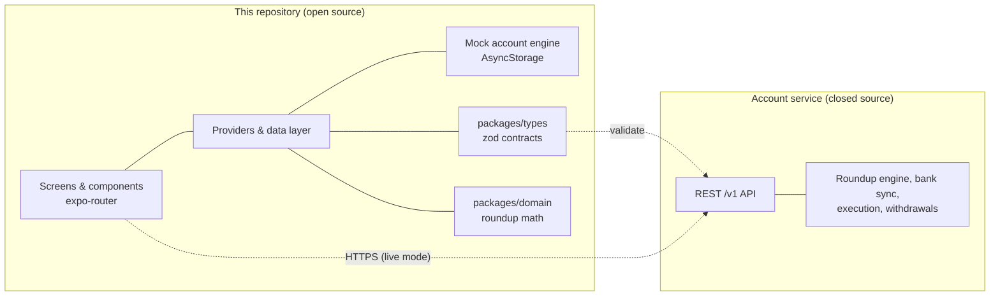

# Architecture

## The big picture

Beaver is a roundup-investing app: it watches connected card purchases, rounds
each one up, and invests the spare change into fractional stock with on-chain
settlement. The system has two halves — and only one of them lives here:

- **Live mode** — the app signs in (Privy), talks HTTPS to the account
  service, and renders real data. Money-moving logic (bank syncing, roundup
  decisions, on-chain execution, withdrawals) runs entirely server-side; the
  client never holds provider credentials.
- **Mock mode** — the default for development. The mock engine mirrors the
  service's behavior for a sample account so every screen works offline.

## Why this split

Open-sourcing the client is deliberate: the UI, navigation, and product
surface benefit from public review, while the engine that connects to banks
and moves funds stays in a controlled codebase. Anything sensitive — provider
credentials, execution logic, database schema — is server-side by
construction.

## Repository map

| Path | Contents |
|---|---|
| `apps/mobile/src/app` | Screens as file routes (expo-router) |
| `apps/mobile/src/components` | UI components; `reacticx/` is the design system |
| `apps/mobile/src/lib` | API client, mock engine (`mock-data.ts`, `mock-fixture.ts`), domain helpers |
| `apps/mobile/src/providers` | Auth, theme, and data providers |
| `packages/types` | Zod schemas shared by client and service — the API contract |
| `packages/domain` | Pure roundup math: integer-cent arithmetic, decision rules. No I/O |

## Conventions worth knowing

- **Strict TypeScript** everywhere, with `noUncheckedIndexedAccess`; contracts
  are validated with Zod at the boundary (`packages/types`).
- **Integer cents** for all money in `packages/domain` — never floats.
- **URL scheme per environment** (`roundups`, `roundups-staging`,
  `roundups-development`), which is why deep links and OAuth redirects key off
  `APP_ENV`.
- The client refuses insecure API URLs (plain HTTP outside local development)
  and treats a missing base URL as a configured failure, not a fallback.
